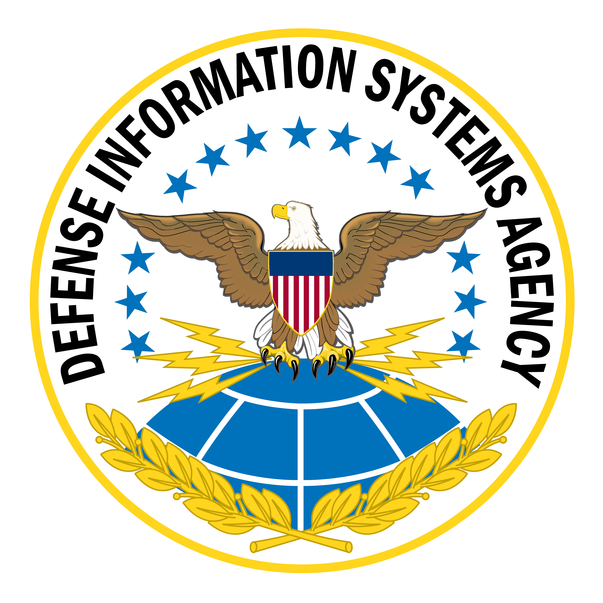

  
  
  

  Hands-on Windows hardening, compliance validation, and PowerShell-driven STIG remediation.

  
  
  
  
  

This repository documents hands-on DISA STIG remediation work completed as part of a cybersecurity internship final phase.

The goal of this project is to identify failed DISA STIG compliance checks, remediate them with PowerShell, validate the changes, and document the results in a professional GitHub portfolio format.

## Project Overview

This project uses a Windows-based virtual machine, Tenable compliance scanning, and PowerShell to complete 10 DISA STIG remediations.

Each remediation includes:

- The failed STIG finding
- A short explanation of the risk
- The PowerShell remediation script
- Validation steps
- Before-and-after evidence
- Screenshots where applicable

<h2>Project Environment & Capabilities</h2>

<table>
  <tr>
    <td width="50%" valign="top">

<h3>Project Environment</h3>

| Component | Details |
|---|---|
| Cloud Platform | Microsoft Azure |
| Target System | Windows VM |
| Scanner | Tenable |
| Audit Type | DISA/STIG Compliance Scan |
| Remediation Method | PowerShell |
| Documentation | GitHub Markdown |

<h3>Tools Used</h3>

<ul>
  <li>Microsoft Azure</li>
  <li>Tenable</li>
  <li>DISA STIG Scan Template</li>
  <li>PowerShell</li>
  <li>Windows Registry</li>
  <li>Local Security Policy</li>
  <li>Group Policy</li>
  <li>VS Code</li>
  <li>GitHub</li>
</ul>

</td>
<td width="50%" valign="top">

<h3>Skills Demonstrated</h3>

<ul>
  <li>DISA STIG compliance analysis</li>
  <li>Windows system hardening</li>
  <li>PowerShell scripting</li>
  <li>Vulnerability and configuration remediation</li>
  <li>Tenable compliance scanning</li>
  <li>Audit finding validation</li>
  <li>Security documentation</li>
  <li>Before-and-after evidence collection</li>
</ul>

<h3>Remediation Focus</h3>

<ul>
  <li>Failed audit finding review</li>
  <li>Registry-based remediation</li>
  <li>PowerShell implementation</li>
  <li>Manual validation</li>
  <li>Tenable rescan confirmation</li>
  <li>GitHub documentation</li>
</ul>

</td>
  </tr>
</table>

## Completed STIG Remediations

## Completed STIG Remediations

| # | STIG ID | Requirement | Status | Link |
|---|---|---|---|---|
| 1 | WN11-AU-000500 | Application event log size must be configured to 32768 KB or greater | Completed | [View Remediation](./WN11-AU-000500/) |
| 2 | WN11-AU-000510 | System event log size must be configured to 32768 KB or greater | Completed | [View Remediation](./WN11-AU-000510/) |
| 3 | WN11-AC-000020 | Password history must be configured to 24 passwords remembered | Completed | [View Remediation](./WN11-AC-000020/) |
| 4 | WN11-AC-000035 | Minimum password length must be configured to 14 characters | Completed | [View Remediation](./WN11-AC-000035/) |
| 5 | WN11-AC-000010 | Number of allowed bad logon attempts must be configured to three or fewer | Completed | [View Remediation](./WN11-AC-000010/) |
| 6 | WN11-CC-000330 | WinRM client must not use Basic authentication | Completed | [View Remediation](./WN11-CC-000330/) |
| 7 | WN11-CC-000360 | WinRM client must not use Digest authentication | Completed | [View Remediation](./WN11-CC-000360/) |
| 8 | WN11-CC-000270 | Remote Desktop Services must prevent users from saving passwords | Completed | [View Remediation](./WN11-CC-000270/) |
| 9 | WN11-AU-000505 | Security event log size must hold at least one week of audit records | In Progress | Pending final validation |
| 10 | WN11-CC-000350 | WinRM service must not allow unencrypted traffic | In Progress | Pending final validation |

## Remediation Workflow

Each STIG remediation follows the same process:

1. Run an initial Tenable DISA/STIG compliance scan.
2. Review failed audit checks in the Tenable Audit tab.
3. Select a failed STIG finding.
4. Research the required configuration.
5. Create a PowerShell remediation script.
6. Apply the remediation to the target VM.
7. Validate the configuration locally.
8. Rescan the VM with Tenable.
9. Document the before-and-after evidence.
10. Publish the completed remediation to GitHub.

## Evidence

Screenshots and scan results will be added as each STIG remediation is completed.

## Project Status

This project is currently in progress.

STIGs Completed: 1 / 10

## Purpose

This project demonstrates practical experience with compliance-based vulnerability management, secure configuration baselines, Windows hardening, and PowerShell-driven remediation.

  

