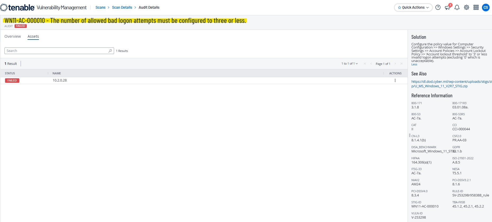
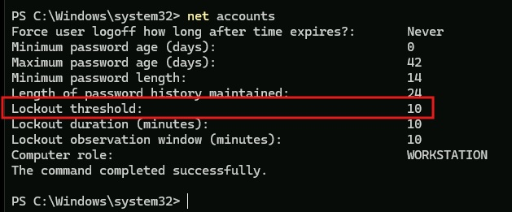
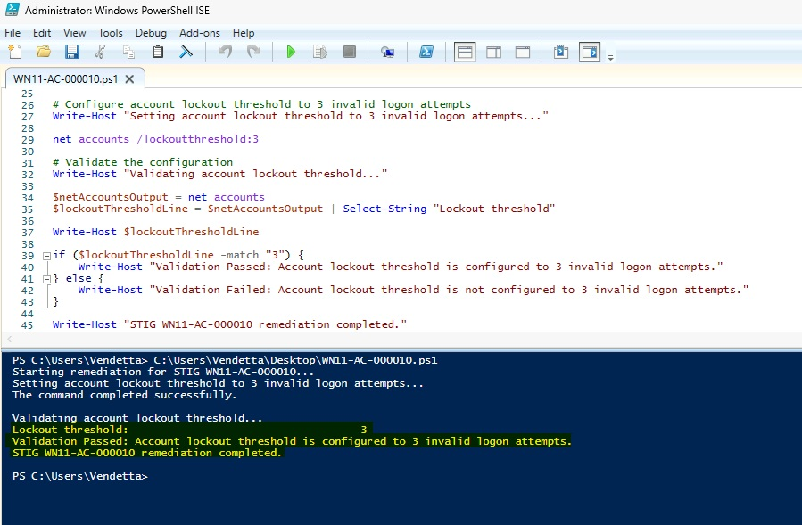
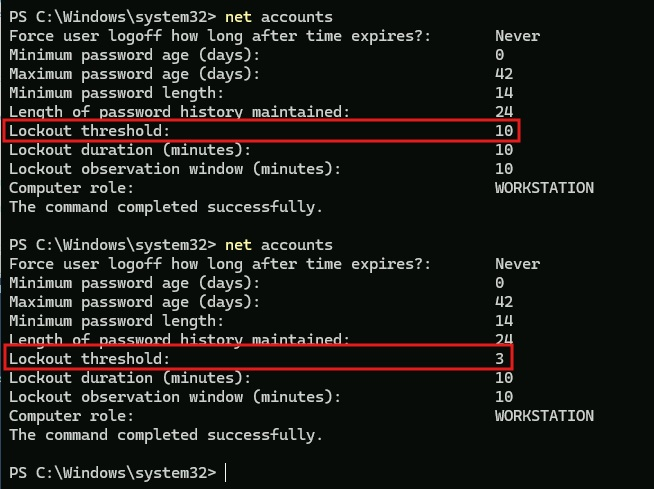
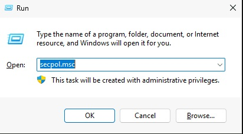
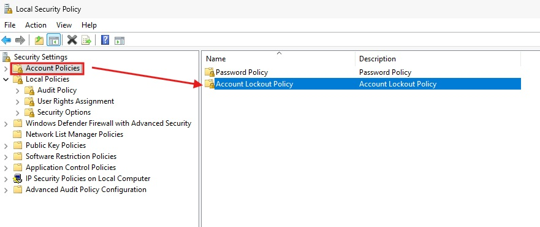
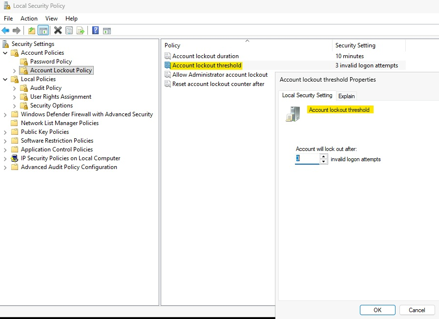
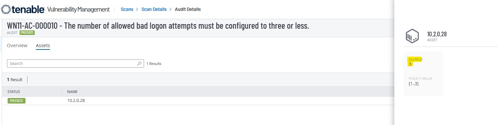

# WN11-AC-000010 - Account Lockout Threshold Requirement

## STIG Information

| Field | Details |
|---|---|
| STIG ID | WN11-AC-000010 |
| Finding | The number of allowed bad logon attempts must be configured to three or fewer. |
| Severity | CAT II / Medium |
| Platform | Windows 11 |
| Remediation Method | Local Security Policy and PowerShell |
| Validation Method | PowerShell validation and Tenable compliance rescan |

---

## Overview

This remediation configures the Windows account lockout threshold to lock an account after three invalid logon attempts. This helps reduce the risk of brute-force password attacks against local user accounts.

---

## Initial Finding

Tenable identified that the system did not meet the required account lockout threshold configuration.



---

## Before Remediation

The system was initially configured with an account lockout threshold that did not meet the STIG requirement.



---

## PowerShell Remediation

The following PowerShell remediation was used to configure the account lockout threshold:

```powershell
net accounts /lockoutthreshold:3
```

The remediation script was executed successfully and validated locally.



---

## Validation

After remediation, the account lockout threshold showed that accounts lock after three invalid logon attempts.



---

## Manual Remediation Reference

The manual remediation path was reviewed and documented to show how the setting can be configured through Local Security Policy. The automated remediation was then implemented using PowerShell and validated locally before the final Tenable rescan.

Manual path:

```text
Local Security Policy
> Security Settings
> Account Policies
> Account Lockout Policy
> Account lockout threshold
```

Set the value to:

```text
3 invalid logon attempts
```







---

## Final Tenable Validation

A follow-up Tenable compliance scan confirmed that the STIG finding was successfully remediated.



---

## Security Impact

Configuring an account lockout threshold helps protect against brute-force logon attempts by temporarily locking accounts after repeated failed authentication attempts. This reduces the likelihood of successful password guessing attacks.

---

## Status

Completed.
