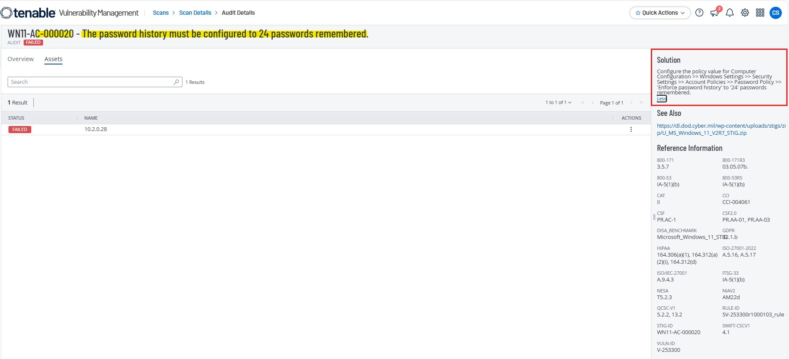
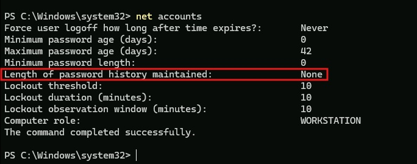
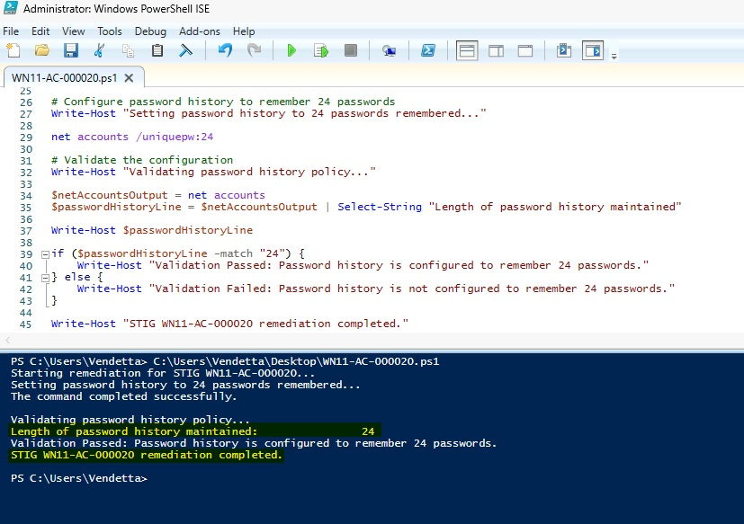
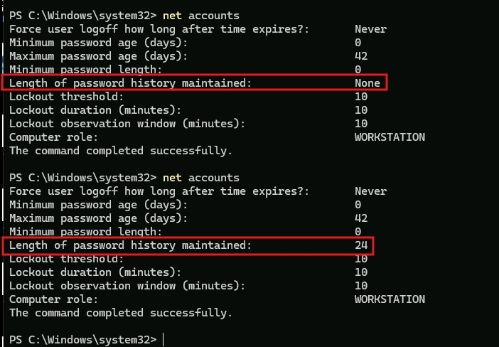
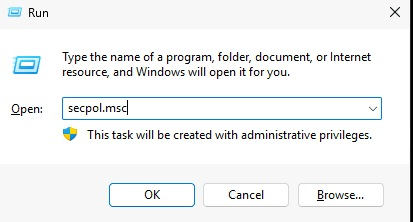
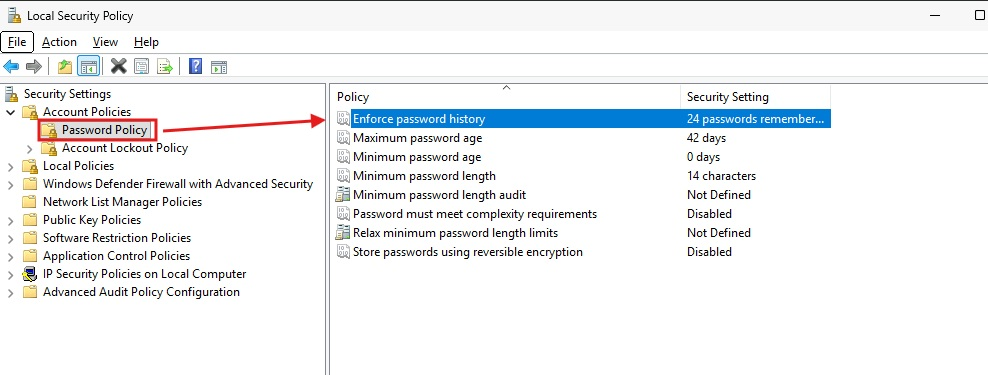
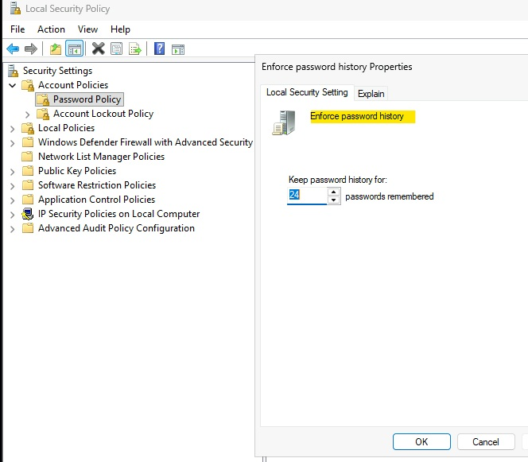
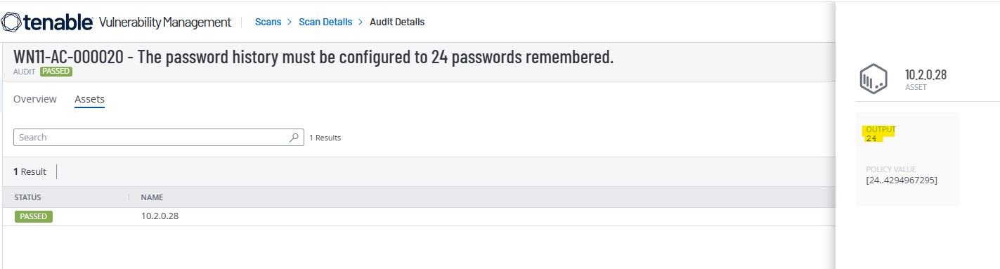

# WN11-AC-000020 - Password History Requirement

## STIG Information

| Field | Details |
|---|---|
| STIG ID | WN11-AC-000020 |
| Finding | The password history must be configured to 24 passwords remembered. |
| Severity | CAT II / Medium |
| Platform | Windows 11 |
| Remediation Method | Local Security Policy and PowerShell |
| Validation Method | PowerShell validation and Tenable compliance rescan |

---

## Overview

This remediation configures the Windows password history policy to remember the previous 24 passwords. This prevents users from repeatedly reusing the same passwords and helps enforce stronger account security practices.

---

## Initial Finding

Tenable identified that the system did not meet the required password history configuration.



---

## Before Remediation

The system was initially configured with no password history requirement.



---

## PowerShell Remediation

The following PowerShell remediation was used to configure the password history requirement:

```powershell
net accounts /uniquepw:24
```

The remediation script was executed successfully and validated locally.



---

## Validation

After remediation, the password history policy showed that 24 passwords are remembered.



---

## Manual Remediation Reference

The manual remediation path was reviewed and documented to show how the setting can be configured through Local Security Policy. The automated remediation was then implemented using PowerShell and validated locally before the final Tenable rescan.

Manual path:

```text
Local Security Policy
> Security Settings
> Account Policies
> Password Policy
> Enforce password history
```

Set the value to:

```text
24 passwords remembered
```







---

## Final Tenable Validation

A follow-up Tenable compliance scan confirmed that the STIG finding was successfully remediated.



---

## Security Impact

Configuring password history reduces the risk of password reuse by preventing users from cycling back to recently used passwords. This supports stronger account security and helps enforce better password hygiene across the system.

---

## Status

Completed.
