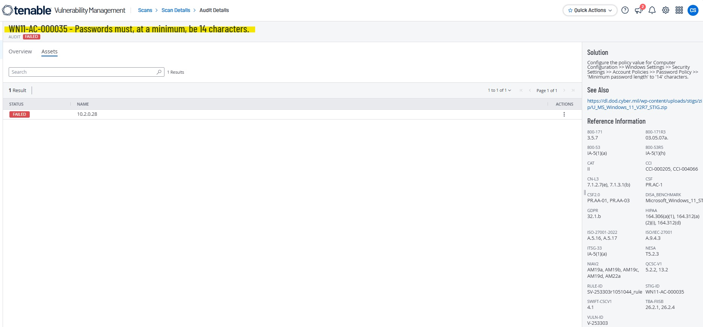
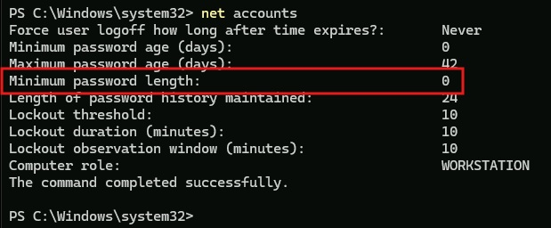
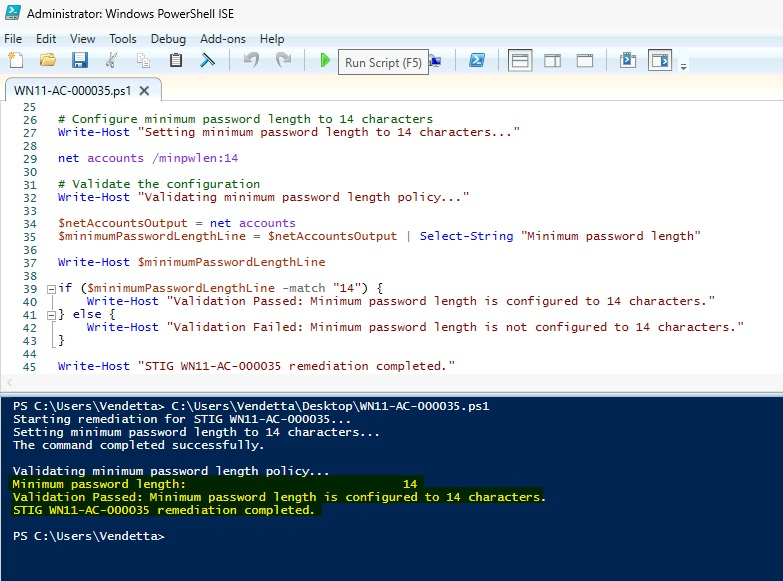
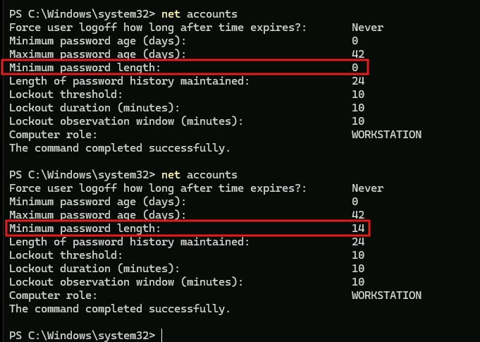
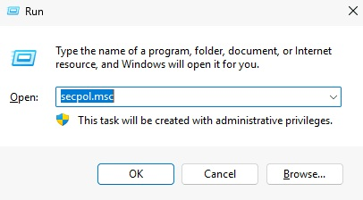
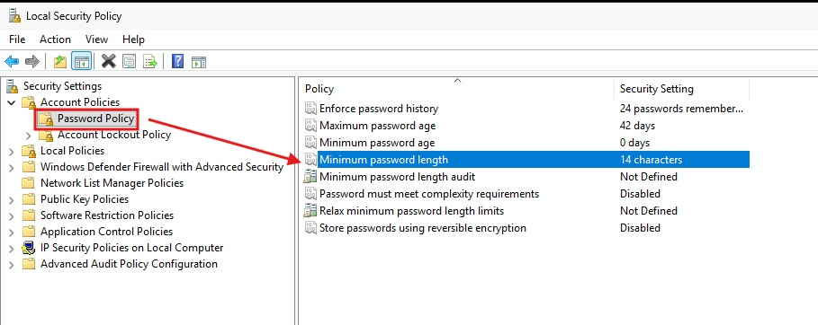
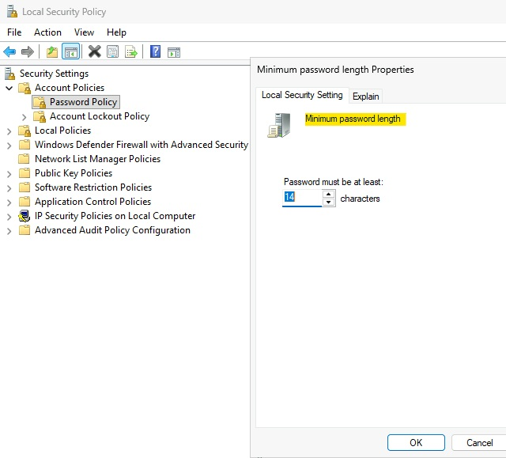
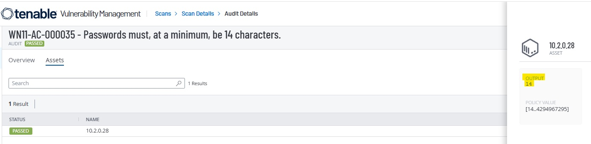

# WN11-AC-000035 - Minimum Password Length Requirement

## STIG Information

| Field | Details |
|---|---|
| STIG ID | WN11-AC-000035 |
| Finding | The minimum password length must be configured to 14 characters. |
| Severity | CAT II / Medium |
| Platform | Windows 11 |
| Remediation Method | Local Security Policy and PowerShell |
| Validation Method | PowerShell validation and Tenable compliance rescan |

---

## Overview

This remediation configures the Windows minimum password length policy to require passwords of at least 14 characters. Longer passwords help improve resistance against brute-force attacks, password guessing, and weak credential reuse.

---

## Initial Finding

Tenable identified that the system did not meet the required minimum password length configuration.



---

## Before Remediation

The system was initially configured with a minimum password length below the STIG requirement.



---

## PowerShell Remediation

The following PowerShell remediation was used to configure the minimum password length requirement:

```powershell
net accounts /minpwlen:14
```

The remediation script was executed successfully and validated locally.



---

## Validation

After remediation, the minimum password length policy showed that passwords must be at least 14 characters.



---

## Manual Remediation Reference

The manual remediation path was reviewed and documented to show how the setting can be configured through Local Security Policy. The automated remediation was then implemented using PowerShell and validated locally before the final Tenable rescan.

Manual path:

```text
Local Security Policy
> Security Settings
> Account Policies
> Password Policy
> Minimum password length
```

Set the value to:

```text
14 characters
```







---

## Final Tenable Validation

A follow-up Tenable compliance scan confirmed that the STIG finding was successfully remediated.



---

## Security Impact

Requiring a minimum password length of 14 characters strengthens account security by making passwords harder to guess or crack. This helps reduce the risk of credential-based attacks against local accounts.

---

## Status

Completed.
