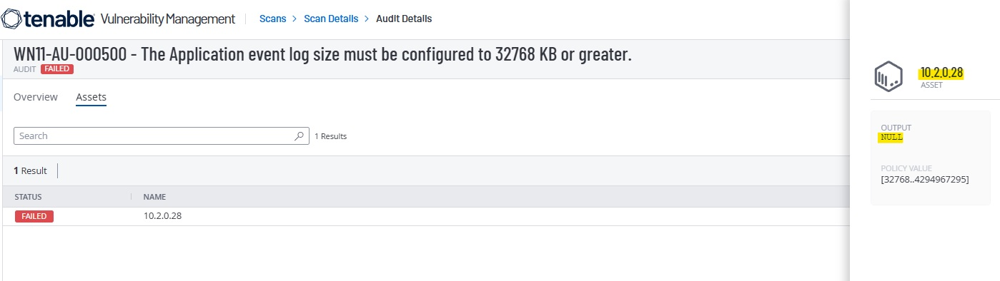
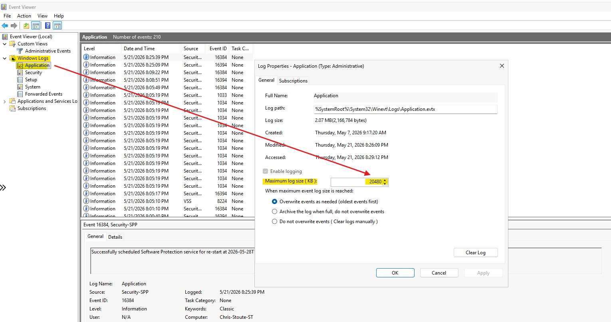
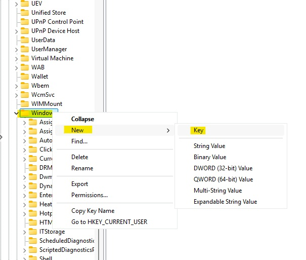
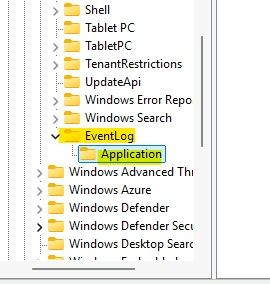
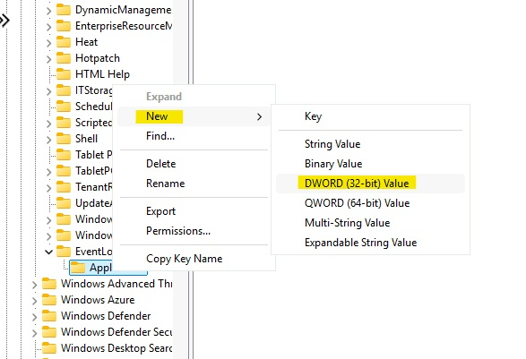
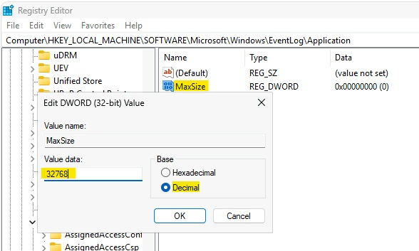
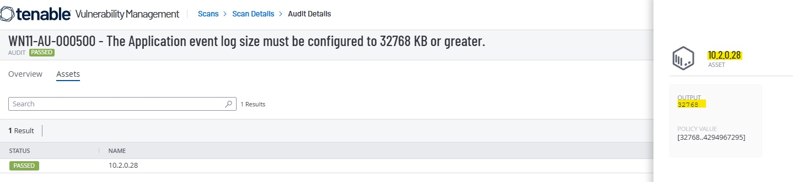

# WN11-AU-000500: Application Event Log Size

## Overview

This remediation addresses DISA STIG finding **WN11-AU-000500**, which requires the Windows Application event log size to be configured to **32768 KB or greater**.

The system originally had the Application event log maximum size configured below the required value. This finding was remediated by creating the required registry policy path and setting the `MaxSize` DWORD value to `32768`.

## STIG Information

| Field | Details |
|---|---|
| STIG ID | WN11-AU-000500 |
| Requirement | The Application event log size must be configured to 32768 KB or greater. |
| Severity | Medium |
| Status Before | Failed |
| Status After | Passed |
| Remediation Method | PowerShell / Registry Configuration |

## Finding

The Application event log was configured with a maximum log size below the DISA STIG requirement.

The initial value observed on the system was:

```text
20480 KB
```

The required value is:

```text
32768 KB or greater
```

## Risk

If the Application event log is too small, important system and application events may be overwritten too quickly. This can reduce visibility during troubleshooting, auditing, incident response, and forensic investigations.

## Manual Remediation Summary

To understand the required fix, the registry path was manually created and configured first.

The following registry path was created:

```text
HKEY_LOCAL_MACHINE\SOFTWARE\Policies\Microsoft\Windows\EventLog\Application
```

Inside the `Application` key, a new DWORD value was created:

```text
Value Name: MaxSize
Value Type: REG_DWORD
Value Data: 32768
Base: Decimal
```

After confirming the manual fix worked, the manual registry changes were removed so the system would fail again. This allowed the remediation to be properly implemented and validated using PowerShell.

## PowerShell Remediation

The PowerShell script recreates the required registry path and sets the `MaxSize` value to `32768`.

```powershell
$registryPath = "HKLM:\SOFTWARE\Policies\Microsoft\Windows\EventLog\Application"
$valueName = "MaxSize"
$valueData = 32768

if (-not (Test-Path $registryPath)) {
    New-Item -Path $registryPath -Force | Out-Null
}

New-ItemProperty `
    -Path $registryPath `
    -Name $valueName `
    -Value $valueData `
    -PropertyType DWord `
    -Force | Out-Null
```

The full remediation script is available here:

[remediation.ps1](./remediation.ps1)

## Validation

The registry value can be validated with the following PowerShell command:

```powershell
Get-ItemProperty -Path "HKLM:\SOFTWARE\Policies\Microsoft\Windows\EventLog\Application" -Name MaxSize
```

Expected result:

```text
MaxSize : 32768
```

The finding was also validated by rescanning the system and confirming that the vulnerability passed after the PowerShell remediation was applied.

## Evidence

### 1. Initial Failed DISA STIG Scan



### 2. Application Log Size Below Requirement



### 3. Creating the Required Windows Registry Key



### 4. EventLog and Application Registry Keys Created



### 5. Creating the MaxSize DWORD Value



### 6. MaxSize Configured to 32768 Decimal



### 7. Passed Scan After PowerShell Remediation



## Security Impact

Configuring the Application event log size to at least 32768 KB helps preserve important event data for auditing, troubleshooting, and incident response. This improves system visibility and reduces the chance that relevant logs are overwritten before they can be reviewed.

## Status

```text
Completed
```
