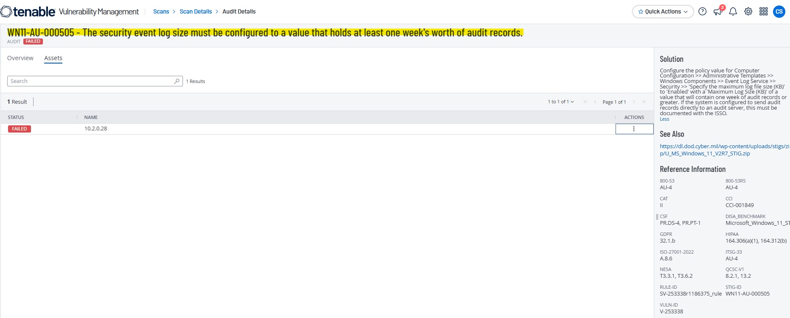
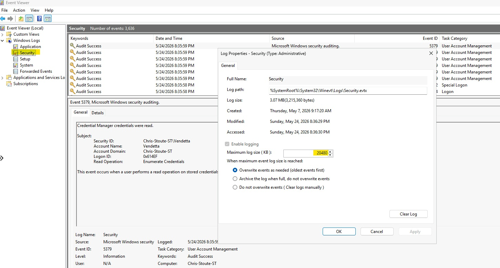
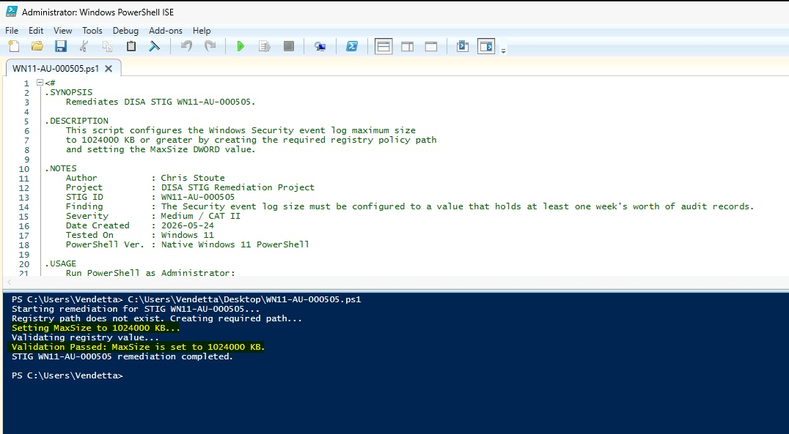
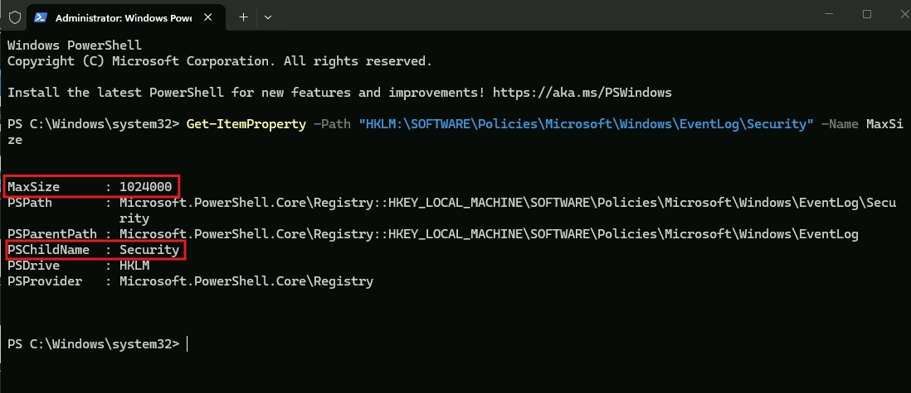
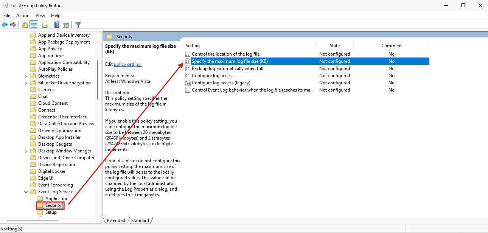
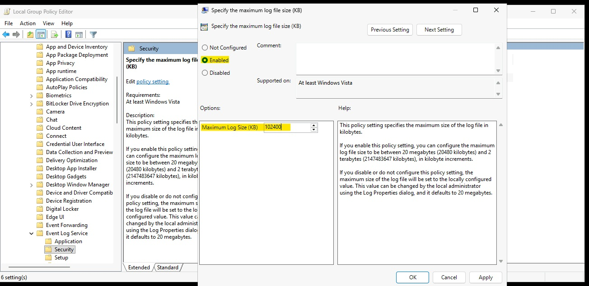
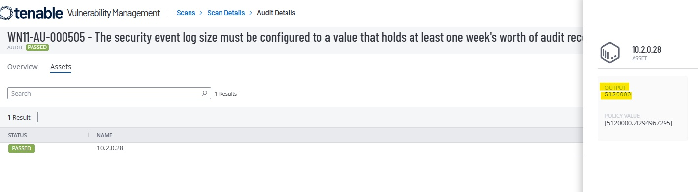

# WN11-AU-000505 - Security Event Log Size Requirement

## STIG Information

| Field | Details |
|---|---|
| STIG ID | WN11-AU-000505 |
| Finding | The Security event log size must be configured to a value that holds at least one week's worth of audit records. |
| Severity | CAT II / Medium |
| Platform | Windows 11 |
| Remediation Method | Local Group Policy and PowerShell |
| Validation Method | PowerShell validation and Tenable compliance rescan |

---

## Overview

This remediation configures the Windows Security event log maximum size to a value large enough to retain at least one week's worth of audit records.

The Security event log contains high-value audit events such as successful logons, failed logons, account changes, privilege use, and other security-relevant activity. If the log size is too small, important events may be overwritten before they can be reviewed during troubleshooting, auditing, threat hunting, or incident response.

---

## Initial Finding

Tenable identified that the system did not meet the required Security event log size configuration.



---

## Before Remediation

The Security event log was initially configured below the required STIG value.



---

## PowerShell Remediation

The initial remediation configured the Security event log `MaxSize` policy value to `1024000`. During validation, Tenable still reported the finding as failed because the audit expected a larger policy value.

The remediation was updated to configure the policy value to `5120000`, which satisfied the Tenable audit requirement.

```powershell
$registryPath = "HKLM:\SOFTWARE\Policies\Microsoft\Windows\EventLog\Security"
$valueName = "MaxSize"
$valueData = 5120000

if (-not (Test-Path $registryPath)) {
    New-Item -Path $registryPath -Force | Out-Null
}

New-ItemProperty `
    -Path $registryPath `
    -Name $valueName `
    -Value $valueData `
    -PropertyType DWord `
    -Force | Out-Null

gpupdate /force
```

The active event log size was also updated using `wevtutil`:

```powershell
wevtutil sl Security /ms:5242880000
```

This value represents `5120000 KB` converted to bytes:

```text
5120000 KB x 1024 = 5242880000 bytes
```



---

## Validation

The registry policy value was validated using PowerShell.

```powershell
Get-ItemProperty -Path "HKLM:\SOFTWARE\Policies\Microsoft\Windows\EventLog\Security" -Name MaxSize
```

Expected result:

```text
MaxSize : 5120000
```



---

## Manual Remediation Reference

The manual remediation path was reviewed and documented to show how the setting can be configured through Local Group Policy Editor. The automated remediation was then implemented using PowerShell and validated locally before the final Tenable rescan.

Manual path:

```text
Local Group Policy Editor
> Computer Configuration
> Administrative Templates
> Windows Components
> Event Log Service
> Security
> Specify the maximum log file size (KB)
```

Set the policy to:

```text
Enabled
Maximum Log Size (KB): 5120000
```





---

## Final Tenable Validation

A follow-up Tenable compliance scan confirmed that the STIG finding was successfully remediated after updating the Security event log size policy value.



---

## Security Impact

Increasing the Security event log size helps preserve important audit events for a longer period of time. This improves visibility for security investigations, incident response, compliance review, and forensic analysis.

---

## Status

Completed.
