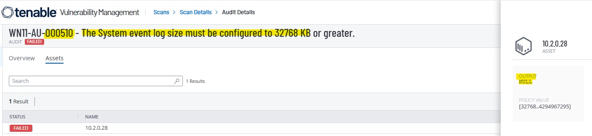
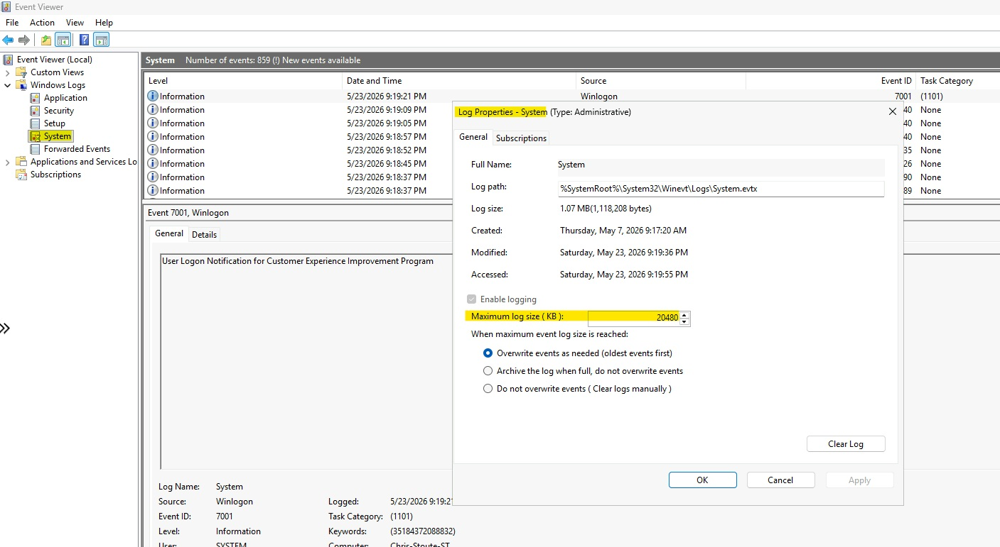
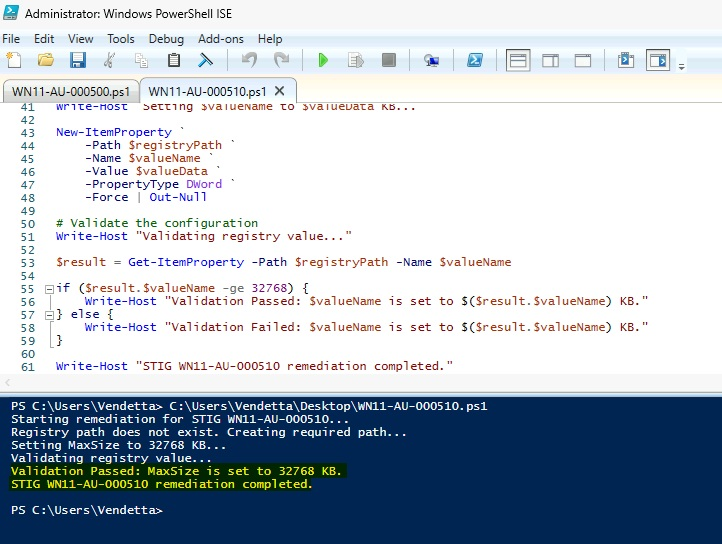
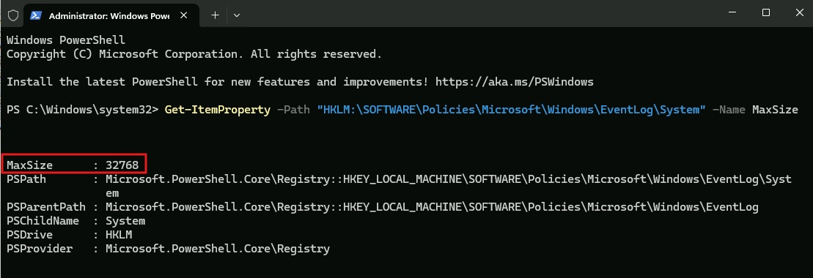
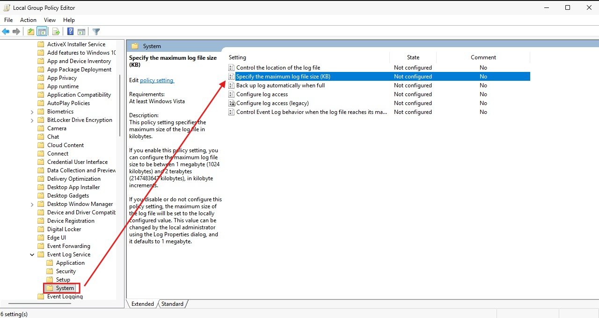
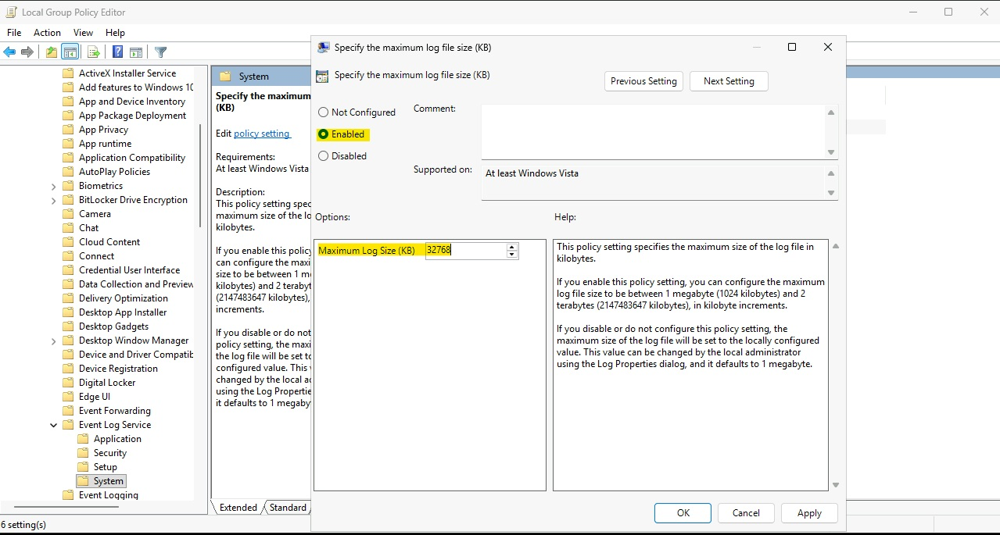
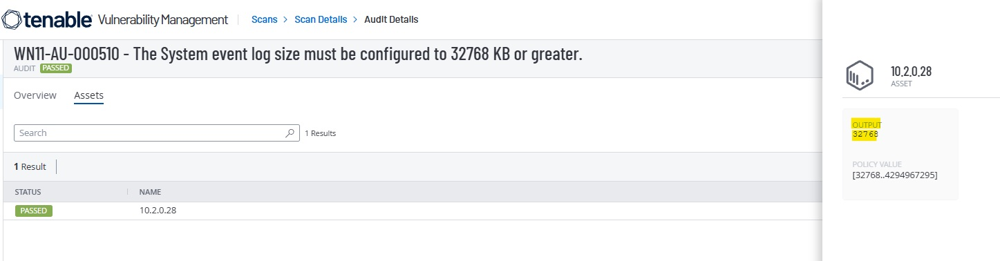

# WN11-AU-000510 - System Event Log Size Requirement

## STIG Information

| Field | Details |
|---|---|
| STIG ID | WN11-AU-000510 |
| Finding | The System event log size must be configured to 32768 KB or greater. |
| Severity | CAT II / Medium |
| Platform | Windows 11 |
| Remediation Method | Local Group Policy and PowerShell |
| Validation Method | PowerShell validation and Tenable compliance rescan |

---

## Overview

This remediation configures the Windows System event log maximum size to 32768 KB or greater. Increasing the System event log size helps preserve important operating system events used for troubleshooting, auditing, and incident response.

---

## Initial Finding

Tenable identified that the system did not meet the required System event log size configuration.



---

## Before Remediation

The System event log was initially configured below the required STIG value.



---

## PowerShell Remediation

The remediation script created the required registry policy path and configured the `MaxSize` DWORD value.

```powershell
$registryPath = "HKLM:\SOFTWARE\Policies\Microsoft\Windows\EventLog\System"
$valueName = "MaxSize"
$valueData = 32768

if (-not (Test-Path $registryPath)) {
    New-Item -Path $registryPath -Force | Out-Null
}

New-ItemProperty `
    -Path $registryPath `
    -Name $valueName `
    -Value $valueData `
    -PropertyType DWord `
    -Force | Out-Null
```

The remediation script was executed successfully and validated locally.



---

## Validation

After remediation, the registry policy value showed that the System event log maximum size was configured to 32768 KB.



---

## Manual Remediation Reference

The manual remediation path was reviewed and documented to show how the setting can be configured through Local Group Policy Editor. The automated remediation was then implemented using PowerShell and validated locally before the final Tenable rescan.

Manual path:

```text
Local Group Policy Editor
> Computer Configuration
> Administrative Templates
> Windows Components
> Event Log Service
> System
> Specify the maximum log file size (KB)
```

Set the policy to:

```text
Enabled
Maximum Log Size (KB): 32768
```





---

## Final Tenable Validation

A follow-up Tenable compliance scan confirmed that the STIG finding was successfully remediated.



---

## Security Impact

Increasing the System event log size helps ensure important system events are retained long enough for review. This improves visibility during troubleshooting, auditing, threat hunting, and incident response.

---

## Status

Completed.
