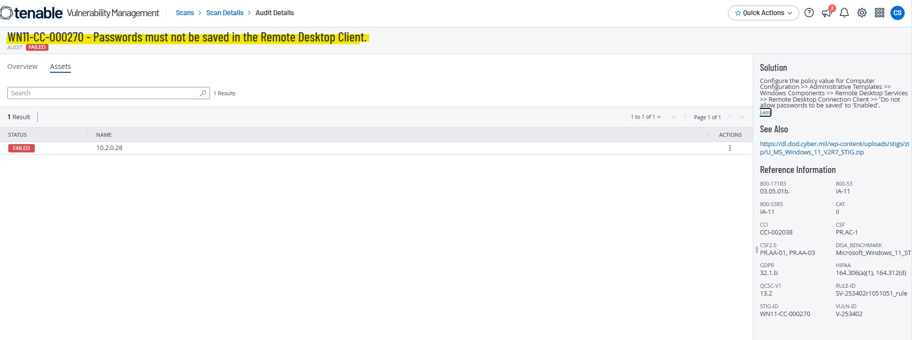
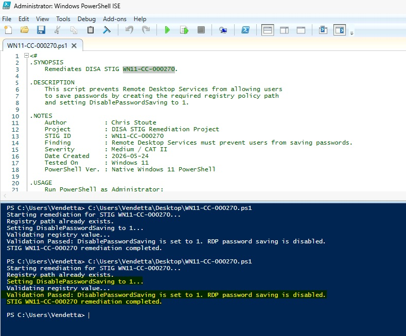
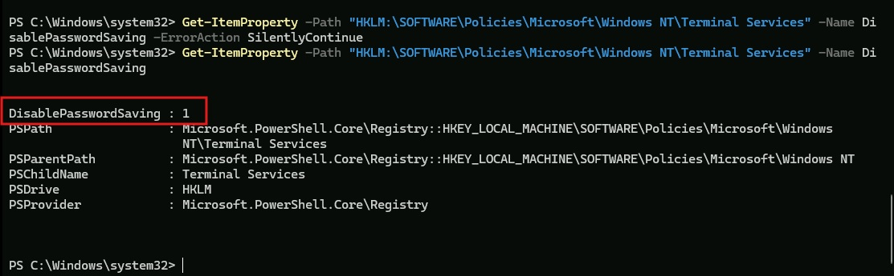
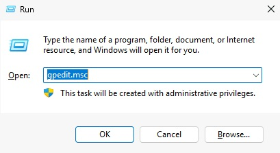
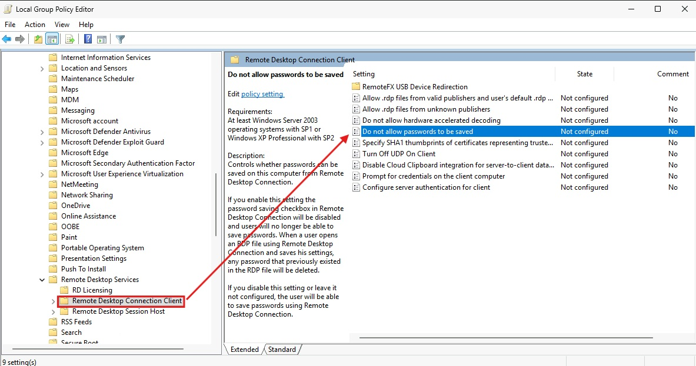
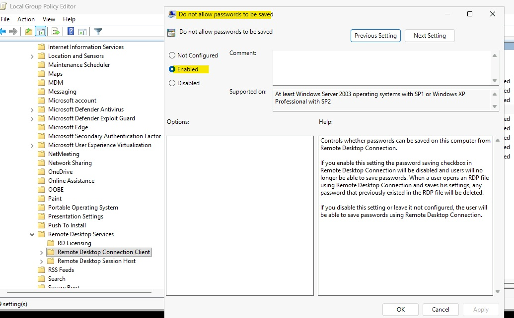
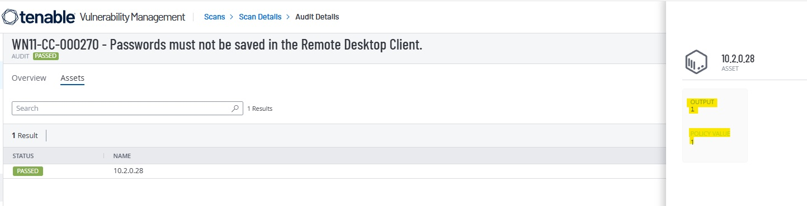

# WN11-CC-000270 - Remote Desktop Password Saving Requirement

## STIG Information

| Field | Details |
|---|---|
| STIG ID | WN11-CC-000270 |
| Finding | Remote Desktop Services must prevent users from saving passwords. |
| Severity | CAT II / Medium |
| Platform | Windows 11 |
| Remediation Method | Local Group Policy and PowerShell |
| Validation Method | PowerShell validation and Tenable compliance rescan |

---

## Overview

This remediation prevents Remote Desktop Services from allowing users to save passwords. Disabling saved RDP passwords helps reduce the risk of stored credential exposure and unauthorized access.

---

## Initial Finding

Tenable identified that the system did not meet the required Remote Desktop password saving configuration.



---

## Before Remediation

The required registry policy value was not explicitly configured before remediation.


---

## PowerShell Remediation

The remediation script created the required registry policy path and configured `DisablePasswordSaving` as a DWORD value of `1`.

```powershell
$registryPath = "HKLM:\SOFTWARE\Policies\Microsoft\Windows NT\Terminal Services"
$valueName = "DisablePasswordSaving"
$valueData = 1

if (-not (Test-Path $registryPath)) {
    New-Item -Path $registryPath -Force | Out-Null
}

New-ItemProperty `
    -Path $registryPath `
    -Name $valueName `
    -Value $valueData `
    -PropertyType DWord `
    -Force | Out-Null
```

The remediation script was executed successfully and validated locally.



---

## Validation

After remediation, the registry policy value showed that RDP password saving was disabled.



---

## Manual Remediation Reference

The manual remediation path was reviewed and documented to show how the setting can be configured through Local Group Policy Editor. The automated remediation was then implemented using PowerShell and validated locally before the final Tenable rescan.

Manual path:

```text
Local Group Policy Editor
> Computer Configuration
> Administrative Templates
> Windows Components
> Remote Desktop Services
> Remote Desktop Connection Client
> Do not allow passwords to be saved
```

Set the policy to:

```text
Enabled
```







---

## Final Tenable Validation

A follow-up Tenable compliance scan confirmed that the STIG finding was successfully remediated.



---

## Security Impact

Preventing saved RDP passwords reduces the risk of credential exposure from stored remote desktop credentials. This supports stronger access control and helps protect systems from unauthorized remote access.

---

## Status

Completed.
