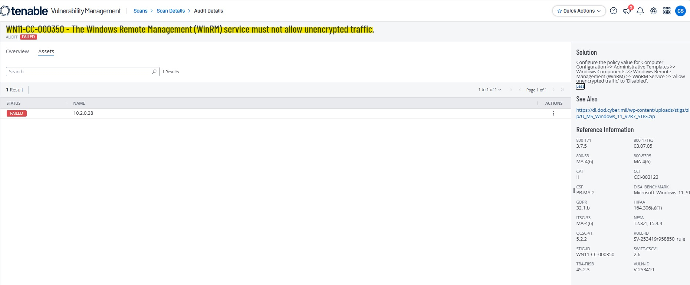
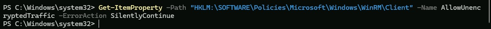
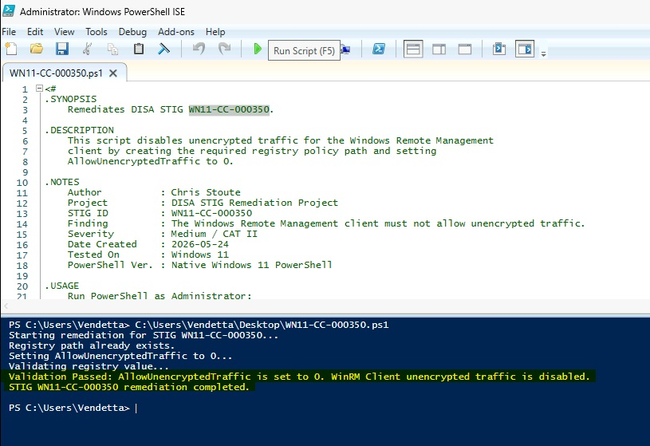
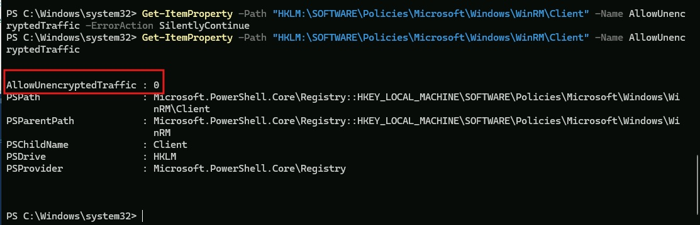
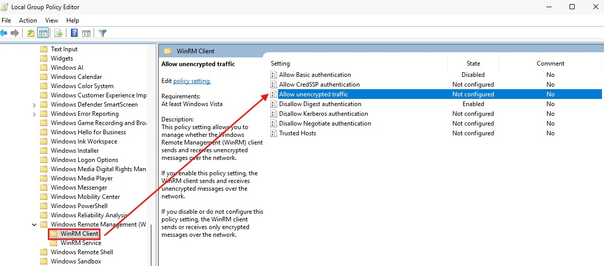
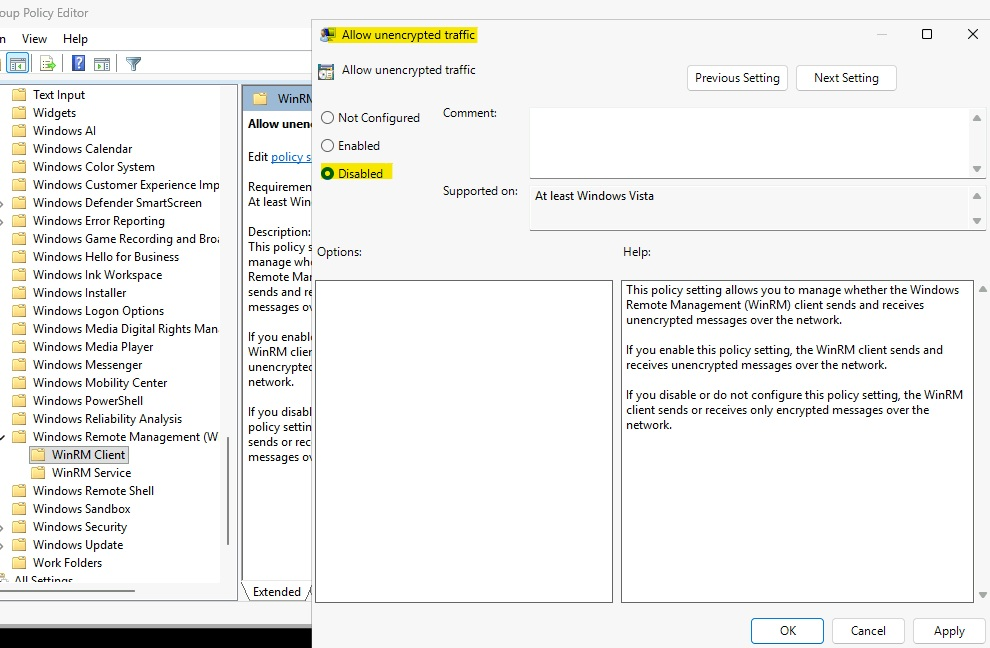
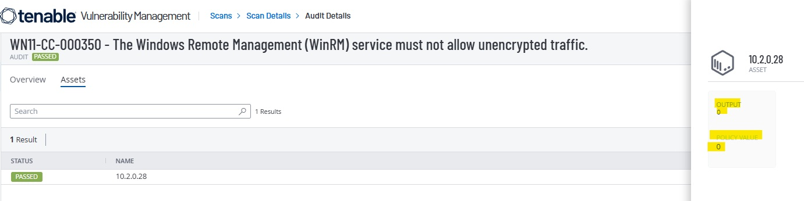

# WN11-CC-000350 - WinRM Service Unencrypted Traffic Requirement

## STIG Information

| Field | Details |
|---|---|
| STIG ID | WN11-CC-000350 |
| Finding | The Windows Remote Management (WinRM) service must not allow unencrypted traffic. |
| Severity | CAT II / Medium |
| Platform | Windows 11 |
| Remediation Method | Local Group Policy and PowerShell |
| Validation Method | PowerShell validation and Tenable compliance rescan |

---

## Overview

This remediation disables unencrypted traffic for the Windows Remote Management service. WinRM is used for remote administration, and allowing unencrypted traffic can expose management communication to interception or tampering.

This STIG requires the WinRM **Service** policy to be configured so unencrypted traffic is not allowed.

---

## Initial Finding

Tenable identified that the system did not meet the required WinRM Service unencrypted traffic configuration.



---

## Before Remediation

The required registry policy value was not explicitly configured before remediation.



---

## PowerShell Remediation

The initial remediation configured the WinRM Client policy path. During validation, Tenable still reported the finding as failed because this STIG checks the WinRM **Service** policy path.

The remediation was updated to configure the correct WinRM Service registry policy path:

```powershell
$registryPath = "HKLM:\SOFTWARE\Policies\Microsoft\Windows\WinRM\Service"
$valueName = "AllowUnencryptedTraffic"
$valueData = 0

if (-not (Test-Path $registryPath)) {
    New-Item -Path $registryPath -Force | Out-Null
}

New-ItemProperty `
    -Path $registryPath `
    -Name $valueName `
    -Value $valueData `
    -PropertyType DWord `
    -Force | Out-Null

gpupdate /force
```

The compliant value is:

```text
AllowUnencryptedTraffic : 0
```



---

## Validation

The registry policy value was validated using PowerShell.

```powershell
Get-ItemProperty -Path "HKLM:\SOFTWARE\Policies\Microsoft\Windows\WinRM\Service" -Name AllowUnencryptedTraffic
```

Expected result:

```text
AllowUnencryptedTraffic : 0
```



---

## Manual Remediation Reference

The manual remediation path was reviewed and documented to show how the setting can be configured through Local Group Policy Editor. The automated remediation was then implemented using PowerShell and validated locally before the final Tenable rescan.

Manual path:

```text
Local Group Policy Editor
> Computer Configuration
> Administrative Templates
> Windows Components
> Windows Remote Management (WinRM)
> WinRM Service
> Allow unencrypted traffic
```

Set the policy to:

```text
Disabled
```






---

## Final Tenable Validation

A follow-up Tenable compliance scan confirmed that the STIG finding was successfully remediated after configuring the WinRM Service policy.



---

## Security Impact

Disabling unencrypted WinRM service traffic helps protect remote management sessions from credential exposure, interception, and tampering. This strengthens administrative communication security and supports secure remote management practices.

---

## Status

Completed.
