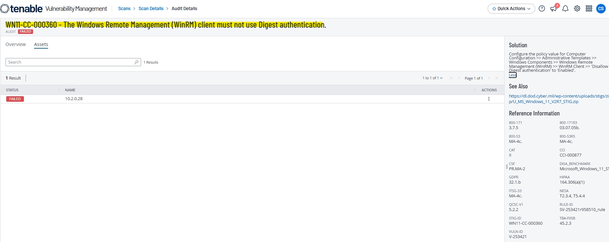
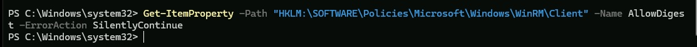
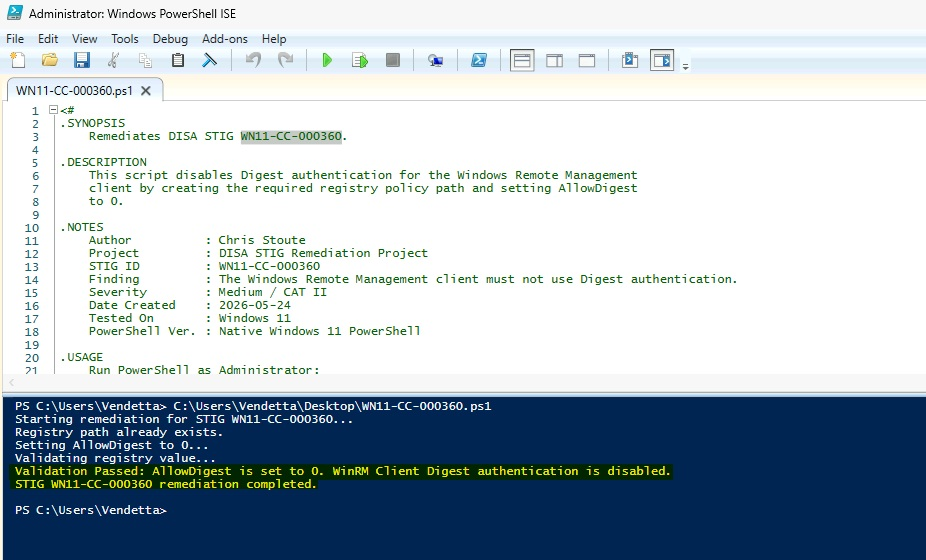
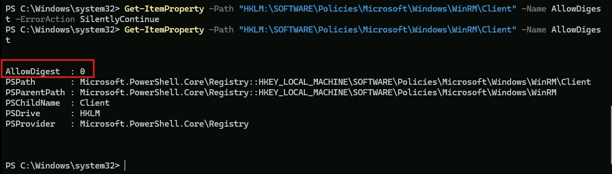
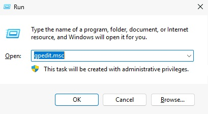
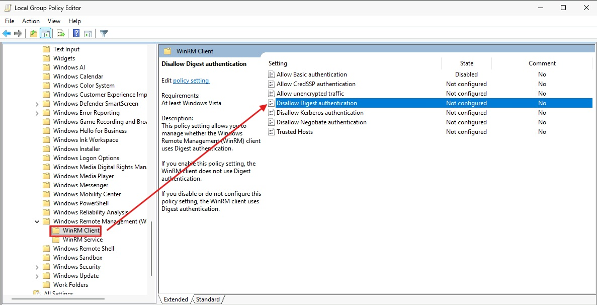
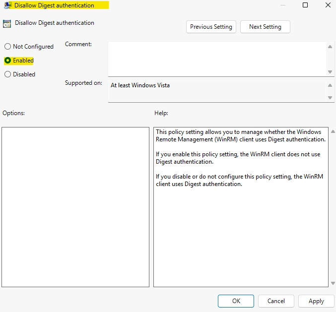
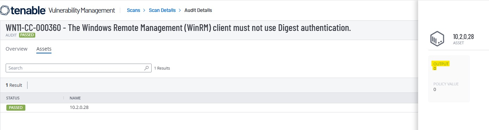

# WN11-CC-000360 - WinRM Client Digest Authentication Requirement

## STIG Information

| Field | Details |
|---|---|
| STIG ID | WN11-CC-000360 |
| Finding | The Windows Remote Management client must not use Digest authentication. |
| Severity | CAT II / Medium |
| Platform | Windows 11 |
| Remediation Method | Local Group Policy and PowerShell |
| Validation Method | PowerShell validation and Tenable compliance rescan |

---

## Overview

This remediation disables Digest authentication for the Windows Remote Management client. Digest authentication is not approved for this STIG configuration and must be explicitly disallowed through policy.

---

## Initial Finding

Tenable identified that the system did not meet the required WinRM Client Digest authentication configuration.



---

## Before Remediation

The required registry policy value was not explicitly configured before remediation.



---

## PowerShell Remediation

The remediation script created the required registry policy path and configured `AllowDigest` as a DWORD value of `0`.

```powershell
$registryPath = "HKLM:\SOFTWARE\Policies\Microsoft\Windows\WinRM\Client"
$valueName = "AllowDigest"
$valueData = 0

if (-not (Test-Path $registryPath)) {
    New-Item -Path $registryPath -Force | Out-Null
}

New-ItemProperty `
    -Path $registryPath `
    -Name $valueName `
    -Value $valueData `
    -PropertyType DWord `
    -Force | Out-Null
```

The remediation script was executed successfully and validated locally.



---

## Validation

After remediation, the registry policy value showed that WinRM Client Digest authentication was disabled.



---

## Manual Remediation Reference

The manual remediation path was reviewed and documented to show how the setting can be configured through Local Group Policy Editor. The automated remediation was then implemented using PowerShell and validated locally before the final Tenable rescan.

Manual path:

```text
Local Group Policy Editor
> Computer Configuration
> Administrative Templates
> Windows Components
> Windows Remote Management (WinRM)
> WinRM Client
> Disallow Digest authentication
```

Set the policy to:

```text
Enabled
```







---

## Final Tenable Validation

A follow-up Tenable compliance scan confirmed that the STIG finding was successfully remediated.



---

## Security Impact

Disabling Digest authentication for the WinRM client helps enforce approved remote management authentication methods and reduces the risk of insecure authentication being used for remote administration.

---

## Status

Completed.
